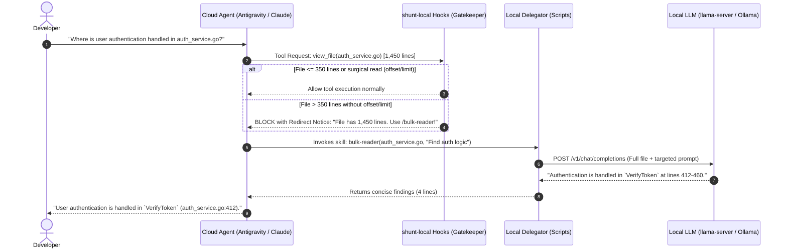

<p align="center">
  <h1 align="center">🔀 shunt-local</h1>
  <p align="center">
    <strong>Hybrid AI Coding: Save 80% to 94% of Cloud Tokens by Delegating Bulk Work to Local LLMs.</strong>
  </p>
  <p align="center">
    <a href="./LICENSE"></a>
    <a href="https://github.com/ggml-org/llama.cpp"></a>
    <a href="#"></a>
    <a href="#"></a>
  </p>
</p>

---

## 💡 Why `shunt-local`?

Modern AI coding agents (**Claude Code**, **Google Antigravity / Gemini CLI**, **Cursor**, **Codex**) are remarkably capable at reasoning, architecture, and multi-step refactoring. However, the standard agent execution loop suffers from a fundamental economic and performance flaw: **Context Bloat**.

When an agent needs to inspect a 2,000-line service to answer a simple question ("what is the signature of `handleOrder`?"), it typically ingests the entire file into its primary context window. 

This triggers three major bottlenecks:
1. **Compounding Token Drain**: That 2,000-line file (~8,000–12,000 tokens) doesn't just cost tokens once. It remains in the primary conversation history and is resent to the cloud provider on **every subsequent prompt and tool call**, rapidly draining your API budget or daily quota buckets.
2. **Context Degradation ("Lost-in-the-Middle")**: Flooding a reasoning model's context window with thousands of lines of boilerplate degrades its attention and reasoning fidelity.
3. **Privacy Exposure**: Massive proprietary files and database dumps are shipped across the public internet to third-party cloud APIs simply for routine extraction.

### 🏛️ Inspired by Spotify's `shunt` Architecture

`shunt-local` is based on the innovative `shunt` architectural pattern pioneered by Spotify's [portal-ai-plugins](https://github.com/spotify/portal-ai-plugins). In Spotify's corporate environment, `shunt` was designed to intercept expensive, high-token operations in Claude Code and offload them to cheaper cloud-hosted models.

### ⚡ The `shunt-local` Innovation: The Hybrid Local + Cloud Mix

While enterprise systems shunt from one paid cloud model to another paid cloud model, **`shunt-local` reuses the local LLM already running on your developer workstation or GPU** (powered by [`llama.cpp`](https://github.com/ggml-org/llama.cpp), [Ollama](https://ollama.com), or [vLLM](https://github.com/vllm-project/vllm)).

This establishes a true **Hybrid Intelligence Pipeline**:

```text
┌─────────────────────────────────────────────────────────────────────────────┐
│                            HYBRID AGENT TOPOLOGY                            │
└─────────────────────────────────────────────────────────────────────────────┘

       ┌──────────────────────────────────────────────────────────────┐
       │             THE ARCHITECT (Cloud Reasoning Agent)             │
       │               Google Antigravity / Claude Code               │
       │                                                              │
       │  • System Design & Multi-File Planning                       │
       │  • Deep Architectural Reasoning                              │
       │  • Complex Debugging & Creative Synthesis                    │
       └──────────────────────────────┬───────────────────────────────┘
                                      │
                         Attempts to read 1,200 lines
                                      │
                         ┌────────────▼─────────────┐
                         │  PreToolUse Hook Gate    │
                         │  (Intercepts & Redirects)│
                         └────────────┬─────────────┘
                                      │
                         Shunts bulk task locally
                                      │
       ┌──────────────────────────────▼───────────────────────────────┐
       │             THE WORKHORSE (Local GPU / Hardware LLM)         │
       │            Qwen 2.5 Coder / Qwen 3.8 / Gemma / Llama          │
       │                                                              │
       │  • Zero-Cost, Zero-Latency Bulk File Ingestion               │
       │  • AST / Function / Schema Extraction                        │
       │  • Repetitive Boilerplate & Unit Test Stubs                  │
       │  • 100% Private — Code Never Leaves Your Machine             │
       └──────────────────────────────┬───────────────────────────────┘
                                      │
                       Returns 10-line concise answer
                                      │
       ┌──────────────────────────────▼───────────────────────────────┐
       │           Primary Agent Context Stays 90%+ Lean!             │
       └──────────────────────────────────────────────────────────────┘
```

---

## 🚀 Key Advantages

- 📉 **80% to 94% Token Savings**: Instead of paying cloud providers for thousands of lines of code over and over again, the cloud model only receives concise summaries or writes targeted diffs.
- 💰 **Zero-Cost Workhorse**: The local LLM runs locally on your RTX GPU, Apple Silicon, or CPU. It costs \$0.00, consumes zero cloud API credits, and never hits 5-hour session quotas.
- 🛡️ **Total Privacy for Bulk Inspections**: Proprietary codebases, internal logs, and confidential schemas are read and parsed entirely on localhost.
- 🔌 **Universal OpenAI-Compatible Interface**: Works seamlessly with any engine exposing a standard `/v1/chat/completions` endpoint (`llama-server`, Ollama, vLLM, LM Studio, Jan, LocalAI).
- 🧩 **Zero OS Argument Ceiling**: Unlike naive CLI tools that pass file contents as argv, `shunt-local` streams payloads over HTTP via temporary JSON files, enabling seamless digestion of 50,000+ line files without hitting `E2BIG` or `ARG_MAX` limitations.
- 🧹 **Automatic Reasoning Tag Stripping**: Automatically filters out internal `<think>...</think>` tags generated by modern reasoning models (DeepSeek, Qwen 3.8, etc.) before handing output back to the agent.
- 🧪 **Rock-Solid Reliability**: 100% test-driven with 58 automated integration and unit evals.

---

## 🧠 How It Works Under the Hood

`shunt-local` operates as an intelligent 3-layer pipeline:



### The 3 Layers:

1. **Layer 1: PreToolUse Hooks (The Gatekeeper)**
   - `hooks/check-file-size`: Intercepts `view_file` (Antigravity) and `Read` (Claude Code). If a file exceeds `min_lines` (default: 350) and no targeted `offset`/`limit` is provided, it blocks execution and instructs the agent to delegate.
   - `hooks/check-bash-read`: Catches terminal commands (`cat`, `head`, `tail`, `less`, `more`) aimed at large files unless they are piped or redirected.
2. **Layer 2: Agent Skills & Scripts (The Delegator)**
   - `skills/bulk-reader` (`scripts/bulk-reader`): Bundles multi-file contexts or large files into an XML-formatted prompt and posts it to the local engine.
   - `skills/code-writer` (`scripts/code-writer`): Instructs the local LLM to generate boilerplate (tests, config, type definitions) and write the file directly to disk, completely bypassing the cloud model's output token limits.
3. **Layer 3: Local Engine (The Hardware Muscle)**
   - Executes inference using quantized weights (GGUF, AWQ, EXL2).

---

## 📥 Installation

### Quick Automated Install

Run the automated installer in your cloned repository:

```bash
git clone https://github.com/devmercenario/shunt-local.git ~/Work/shunt-local
cd ~/Work/shunt-local
chmod +x install.sh
./install.sh
```

The installer will:
1. Validate system dependencies (`curl`, `jq`, `python3`).
2. Generate your user configuration at `~/.config/shunt-local/config.json`.
3. Install agent skills (`bulk-reader`, `code-writer`) into `~/.agents/skills/`.
4. Register the plugin with Antigravity CLI via `agy plugin install .`.
5. Register lifecycle hooks into `~/.gemini/config/hooks.json` (safely merging without affecting other plugins like `ai-memory`).

### Clean Uninstall

To remove `shunt-local` and restore your previous configuration at any time:

```bash
./uninstall.sh
```

---

## ⚙️ Configuration

`shunt-local` evaluates configuration in a strict hierarchical order:
1. **Environment Variables** (`SHUNT_ENDPOINT`, `SHUNT_MODEL`, etc.)
2. **Custom Config Path** (`SHUNT_CONFIG_PATH=/path/to/config.json`)
3. **Project Config** (`./shunt.config.json`)
4. **User Global Config** (`~/.config/shunt-local/config.json`)
5. **Built-in Defaults**

### Configuration File (`~/.config/shunt-local/config.json`)

```json
{
  "endpoint": "http://127.0.0.1:8080/v1/chat/completions",
  "model": "empero-ai/Qwen3.8-9B-Distill-GGUF",
  "temperature": 0.2,
  "min_lines": 350,
  "timeout_seconds": 180,
  "api_key": ""
}
```

### Configuration Options

| Option | Env Variable | Default | Description |
| :--- | :--- | :--- | :--- |
| `endpoint` | `SHUNT_ENDPOINT` | `http://127.0.0.1:8080/v1/chat/completions` | Local inference server URL |
| `model` | `SHUNT_MODEL` | `empero-ai/Qwen3.8-9B-Distill-GGUF` | Model identifier passed to local server |
| `temperature` | `SHUNT_TEMPERATURE`| `0.2` | Sampling temperature (low for deterministic code analysis) |
| `min_lines` | `SHUNT_MIN_LINES` | `350` | File line threshold before blocking direct reads |
| `timeout_seconds` | `SHUNT_TIMEOUT_SECONDS` | `180` | Max duration before timing out local inference |
| `api_key` | `SHUNT_API_KEY` | `""` | Optional Bearer authorization token header |

---

## 🖥️ Recommended Local Models & Server Setup

### Option 1: `llama.cpp` (`llama-server`) — Recommended for Maximum Performance

For an NVIDIA RTX GPU (RTX 3060, 4070, 5060 Ti, etc.) or Apple Silicon:

```bash
# High-speed reasoning & coding model (fits in 8-16 GB VRAM)
llama-server \
  -hf empero-ai/Qwen3.8-9B-Distill-GGUF:Q4_K_M \
  --port 8080 \
  -ngl 99 \
  -c 32768 \
  --flash-attn \
  --temp 0.2
```

### Option 2: Ollama

```bash
# Pull model
ollama run qwen2.5-coder:14b
```
Update `~/.config/shunt-local/config.json`:
```json
{
  "endpoint": "http://127.0.0.1:11434/v1/chat/completions",
  "model": "qwen2.5-coder:14b"
}
```

### Option 3: vLLM (For High-Throughput Linux Workstations)

```bash
vllm serve Qwen/Qwen2.5-Coder-7B-Instruct \
  --port 8080 \
  --max-model-len 32768
```

---

## 🎯 Hands-On Examples

### Scenario 1: Reading a Massive Service File
The cloud agent tries to execute `view_file("internal/billing/processor.go")` (2,100 lines).

1. `shunt-local` blocks the call:
   ```text
   File internal/billing/processor.go has 2100 lines (threshold: 350).
   Do not read this file directly into context.
   Delegate to the local LLM using:
     bulk-reader internal/billing/processor.go "your question"
   ```
2. The agent transparently invokes `bulk-reader`:
   ```bash
   bulk-reader internal/billing/processor.go "How are retried invoices calculated?"
   ```
3. The local LLM parses the 2,100 lines in ~1.5s on GPU and returns 4 bullet points.
4. The cloud agent continues solving the user's issue with 95% fewer tokens in context.

### Scenario 2: Generating Boilerplate Tests
Instead of paying cloud model rates to write 300 lines of repetitive test table cases:
```text
User: "Write unit tests for the validator functions in validation.go"
Agent: Invokes code-writer with reference files.
Local LLM: Generates tests/validator_test.go directly on disk.
```

---

## 🧪 Comprehensive Automated Test Suite

`shunt-local` is strictly engineered with automated test verification:

```bash
./evals/run.sh
```

Tests cover:
- ✅ **File Size Hook**: Threshold enforcement, targeted read (`offset`/`limit`) pass-through, missing file handling, env overrides.
- ✅ **Bash Command Hook**: Detection of `cat`, `head`, `tail`, `less`, `more`, pipe/redirect passthroughs.
- ✅ **Config Resolution**: Precedence order between env vars, local files, and user configs.
- ✅ **Transport Layer**: Payload formatting, mock HTTP handling, error extraction, and reasoning tag cleanup.

```text
════════════════════════════════════════════════════════════════
Total: 58 passed, 0 failed, 58 total
════════════════════════════════════════════════════════════════
```

---

## 📄 License & Attribution

- Released under the [Apache-2.0 License](./LICENSE).
- **Attribution**: Built on core conceptual patterns from Spotify's [portal-ai-plugins](https://github.com/spotify/portal-ai-plugins) project, adapted and reimagined for local hardware inference and developer workstations.
