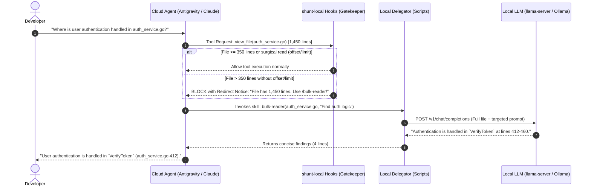
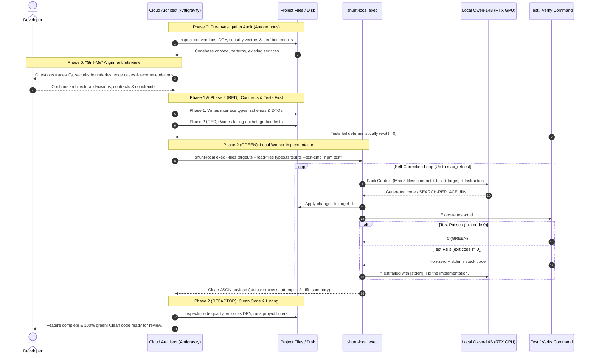
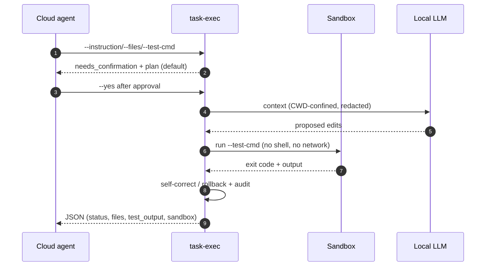
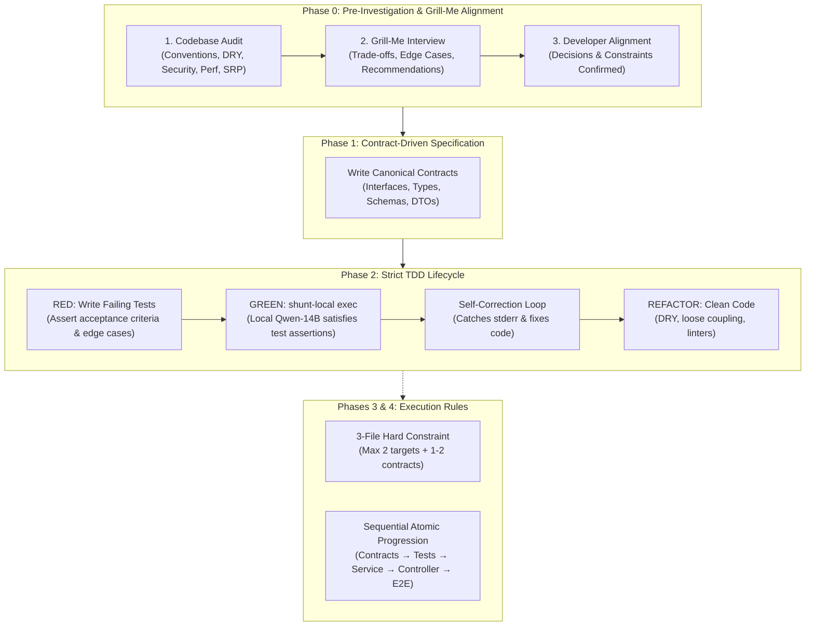

<p align="center">
  <h1 align="center">🔀 shunt-local</h1>
  <p align="center">
    <strong>Hybrid AI Coding: Save 80% to 94% of Cloud Tokens by Delegating Bulk Work to Local LLMs.</strong>
  </p>
  <p align="center">
    <a href="./LICENSE"></a>
    <a href="https://github.com/ggml-org/llama.cpp"></a>
    <a href="#"></a>
    <a href="#"></a>
    <a href="#"></a>
  </p>
</p>

---

## 📑 Table of Contents

- [💡 Why `shunt-local`?](#why-shunt-local)
- [🚀 Key Advantages](#key-advantages)
- [🧠 How It Works Under the Hood](#how-it-works-under-the-hood)
- [📥 Installation](#installation)
  - [Quick Automated Install](#quick-automated-install)
  - [Operating System & Platform Compatibility](#operating-system-platform-compatibility)
  - [Clean Uninstall](#clean-uninstall)
- [⚙️ Configuration](#configuration)
- [🎛️ CLI & Management Commands](#cli-management-commands)
- [🏛️ Architect Engineering Protocol](#architect-engineering-protocol-pre-investigation-grill-me-tdd)
- [🖥️ Recommended Local Models & Server Setup](#recommended-local-models-server-setup)
- [🎯 Hands-On Examples](#hands-on-examples)
- [🧪 Comprehensive Automated Test Suite](#comprehensive-automated-test-suite)
- [📄 License & Attribution](#license-attribution)

---

## 💡 Why `shunt-local`?

Modern AI coding agents (**Claude Code**, **Google Antigravity / Gemini CLI**, **Cursor**, **Codex**) are remarkably capable at reasoning, architecture, and multi-step refactoring. However, the standard agent execution loop suffers from a fundamental economic and performance flaw: **Context Bloat**.

When an agent needs to inspect a 2,000-line service to answer a simple question ("what is the signature of `handleOrder`?"), it typically ingests the entire file into its primary context window. 

This triggers three major bottlenecks:
1. **Compounding Token Drain**: That 2,000-line file (~8,000–12,000 tokens) doesn't just cost tokens once. It remains in the primary conversation history and is resent to the cloud provider on **every subsequent prompt and tool call**, rapidly draining your API budget or daily quota buckets.
2. **Context Degradation ("Lost-in-the-Middle")**: Flooding a reasoning model's context window with thousands of lines of boilerplate degrades its attention and reasoning fidelity.
3. **Privacy Exposure**: Massive proprietary files and database dumps are shipped across the public internet to third-party cloud APIs simply for routine extraction.

### 🏛️ Inspired by Spotify's `shunt` Architecture

`shunt-local` is based on the innovative `shunt` architectural pattern pioneered by Spotify's [portal-ai-plugins](https://github.com/spotify/portal-ai-plugins). In Spotify's corporate environment, `shunt` was designed to intercept expensive, high-token operations in Claude Code and offload them to cheaper cloud-hosted models.

### ⚡ The `shunt-local` Innovation: The Hybrid Local + Cloud Mix

While enterprise systems shunt from one paid cloud model to another paid cloud model, **`shunt-local` reuses the local LLM already running on your developer workstation or GPU** (powered by [`llama.cpp`](https://github.com/ggml-org/llama.cpp), [Ollama](https://ollama.com), or [vLLM](https://github.com/vllm-project/vllm)).

This establishes a true **Dual-Flow Hybrid Intelligence Pipeline**:

```text
┌─────────────────────────────────────────────────────────────────────────────┐
│                            HYBRID AGENT TOPOLOGY                            │
└─────────────────────────────────────────────────────────────────────────────┘

       ┌──────────────────────────────────────────────────────────────┐
       │             THE ARCHITECT (Cloud Reasoning Agent)             │
       │               Google Antigravity / Claude Code               │
       │                                                              │
       │  • Codebase Pre-Investigation & "Grill-Me" Alignment         │
       │  • Contract-Driven Design (Interfaces, Types, Schemas)       │
       │  • Strict TDD: Writes failing tests first (RED phase)        │
       └──────────────┬───────────────────────────────┬───────────────┘
                      │                               │
        [Flow 1: Bulk Read Gate]         [Flow 2: Subtask Worker Delegation]
                      │                               │
       Attempts to read 1,200+ lines       Dispatches TaskContract JSON
                      │                    (instruction, targets, test-cmd)
       ┌──────────────▼─────────────┐                 │
       │    PreToolUse Hook Gate    │                 │
       │  (Intercepts & Redirects)  │                 │
       └──────────────┬─────────────┘                 │
                      │                               │
             Shunts to bulk-reader                    │
                      │                               │
       ┌──────────────▼───────────────────────────────▼───────────────┐
       │             THE WORKHORSE (Local GPU / Hardware LLM)         │
       │               Qwen 2.5 Coder (14B / 7B / 32B IQ3)            │
       │                                                              │
       │  • Zero-Cost, Instant Bulk File Ingestion & AST Extraction   │
       │  • Autonomous Code Implementation & SEARCH/REPLACE Diffs     │
       │  • Self-Correction Loop: Runs test-cmd & fixes syntax/errors │
       │  • 100% Private & Free: Runs at 55+ tok/s on Local Hardware  │
       └──────────────┬───────────────────────────────┬───────────────┘
                      │                               │
        Returns 5-line summary              Returns clean JSON summary
        (Zero file tokens retained)         (attempts, diff stat, green tests)
                      │                               │
       ┌──────────────▼───────────────────────────────▼───────────────┐
       │           Primary Agent Context Stays 90%+ Lean!             │
       └──────────────────────────────────────────────────────────────┘
```

---

## 🚀 Key Advantages

- 📉 **80% to 94% Token Savings**: Instead of paying cloud providers for thousands of lines of code over and over again, the cloud model only receives concise summaries or writes targeted diffs.
- 💰 **Zero-Cost Workhorse**: The local LLM runs locally on your RTX GPU, Apple Silicon, or CPU. It costs \$0.00, consumes zero cloud API credits, and never hits 5-hour session quotas.
- 🛡️ **Total Privacy for Bulk Inspections**: Proprietary codebases, internal logs, and confidential schemas are read and parsed entirely on localhost.
- 🔌 **Universal OpenAI-Compatible Interface**: Works seamlessly with any engine exposing a standard `/v1/chat/completions` endpoint (`llama-server`, Ollama, vLLM, LM Studio, Jan, LocalAI).
- 🧩 **Zero OS Argument Ceiling**: Unlike naive CLI tools that pass file contents as argv, `shunt-local` streams payloads over HTTP via temporary JSON files, enabling seamless digestion of 50,000+ line files without hitting `E2BIG` or `ARG_MAX` limitations.
- 🧹 **Automatic Reasoning Tag Stripping**: Automatically filters out internal `<think>...</think>` tags generated by modern reasoning models (DeepSeek, Qwen 3.8, etc.) before handing output back to the agent.
- 🧪 **Rock-Solid Reliability**: 100% test-driven with 328 automated integration, unit, security, sandbox, fuzz, portability and packaging evals.

---

## 🧠 How It Works Under the Hood

`shunt-local` operates as an intelligent 3-layer pipeline across two core execution flows:

### Flow 1: Large File Inspection & Gatekeeping



### Flow 2: Autonomous Subtask Worker & TDD Execution Loop



### The 3 Layers:

1. **Layer 1: PreToolUse Hooks (The Gatekeeper)**
   - `hooks/check-file-size`: Intercepts `view_file` (Antigravity) and `Read` (Claude Code). If a file exceeds `min_lines` (default: 350) and no targeted `offset`/`limit` is provided, it blocks execution and instructs the agent to delegate.
   - `hooks/check-bash-read`: Catches terminal commands (`cat`, `head`, `tail`, `less`, `more`) aimed at large files unless they are piped or redirected.
2. **Layer 2: Agent Skills & Scripts (The Delegator & Worker)**
   - `scripts/shunt-local`: Unified CLI for Master Switch (`on`/`off`), subhook toggles, and task dispatching.
   - `skills/subtask-worker` (`scripts/task-exec`): Autonomous worker implementing the TaskContract, Context Packer, self-correction retry loop, and rollback handler.
   - `skills/bulk-reader` (`scripts/bulk-reader`): Bundles multi-file contexts or large files into an XML-formatted prompt and posts it to the local engine.
   - `skills/code-writer` (`scripts/code-writer`): Instructs the local LLM to generate boilerplate (tests, config, type definitions) and write the file directly to disk.
3. **Layer 3: Local Engine (The Hardware Muscle)**
   - Executes inference using quantized weights (GGUF, AWQ, EXL2).

---

## 📥 Installation

### Quick Automated Install

**One-liner (recommended)** — downloads the latest snapshot and installs it:

```bash
curl -fsSL https://raw.githubusercontent.com/devmercenario/shunt-local/main/install.sh | bash
```

The snapshot is kept at `~/.local/share/shunt-local` (override with
`SHUNT_INSTALL_DIR`). Update it later with `shunt-update --yes`.

**From a clone** — for development or a pinned version:

```bash
git clone https://github.com/devmercenario/shunt-local.git ~/Work/shunt-local
cd ~/Work/shunt-local
./install.sh
```

`install.sh` fast-forwards the clone to `origin/main` before installing
(opt out with `SHUNT_NO_PULL=1`).

The installer will:
1. Validate system dependencies (`curl`, `jq`, `python3`).
2. Generate your user configuration at `~/.config/shunt-local/config.json` (protected with `0700`/`0600` permissions).
3. Link CLI binaries (`shunt-local`, `task-exec`, `bulk-read`, `code-write`, `shunt-update`) into `~/.local/bin/`.
4. Install agent skills (`bulk-reader`, `code-writer`, `subtask-worker`) into `~/.agents/skills/`.
5. Register with Google Antigravity (`agy plugin install .` and `~/.gemini/config/hooks.json`).
6. Register with Claude Code (`claude plugin install .` if `claude` is detected).
7. Install OpenCode native plugin (`~/.config/opencode/plugins/shunt-local.ts` if OpenCode is detected).
8. Validate your `$PATH` to ensure `~/.local/bin` is accessible.

### 🌐 Operating System & Platform Compatibility

| OS / Platform | Support Level | Notes |
| :--- | :--- | :--- |
| **Linux** (Ubuntu, Debian, Fedora, Arch) | **100% Native** | Full hook interception, skills, and CLI binaries out-of-the-box. |
| **macOS** (Apple Silicon / Intel) | **100% Native (POSIX)** | Portable symlink resolution; compatible with default Zsh/Bash shells. |
| **Windows (WSL2)** | **100% Supported** | Recommended Windows environment for GPU acceleration (CUDA) and agents. |
| **Windows (Native CMD / PowerShell)** | Manual CLI | Requires WSL2 or bash environment for lifecycle hooks. |
| **Google Antigravity & Gemini CLI** | **100% Native** | PreToolUse hooks intercept `view_file` and `run_command` automatically. |
| **Claude Code** | **100% Native** | Official plugin structure; intercepts `Read` and `Bash` via `hooks.json`. |
| **OpenCode** | **100% Native** | Official TypeScript plugin (`shunt-local.ts`) intercepting `read` and `bash`. |
| **Cursor** | Native CLI + Rules | Use bundled `.cursorrules` / `.cursor/rules/shunt-local.mdc` to guide delegation. |

### Clean Uninstall

To remove `shunt-local` and restore your previous configuration at any time:

```bash
./uninstall.sh                     # from a clone
bash ~/.local/share/shunt-local/uninstall.sh   # curl-installed copy
```

Add `--purge` to also delete `~/.config/shunt-local` (including any stored API keys).

---

## ⚙️ Configuration

`shunt-local` evaluates configuration in a strict hierarchical order:
1. **Environment Variables** (`SHUNT_ENDPOINT`, `SHUNT_MODEL`, etc.)
2. **Custom Config Path** (`SHUNT_CONFIG_PATH=/path/to/config.json`)
3. **Project Config** (`./shunt.config.json`) — **requires `SHUNT_ALLOW_PROJECT_CONFIG=true`** (ignored otherwise, so a cloned repo cannot silently redirect your inference)
4. **User Global Config** (`~/.config/shunt-local/config.json`)
5. **Built-in Defaults**

> 🔒 **Security defaults**: remote endpoints (HTTP *and* HTTPS) are blocked unless `SHUNT_ALLOW_REMOTE=true`, and only `http`/`https` are accepted; `--test-cmd`/`--rollback-cmd` run **without a shell** inside an OS **sandbox** (bwrap/firejail/docker, no network) and are restricted to a strict token allowlist unless `--allow-unsafe` + `SHUNT_ALLOW_UNSAFE=true`; file writes are confined to the working directory and **require approval** (`--apply-mode confirm`, `--yes` to auto-apply) and home dotfiles plus VCS/CI/credential/build files are refused unless `SHUNT_ALLOW_SENSITIVE_WRITES=true`; reads are confined and outbound payloads are **secret-redacted**; the API key is passed via a `0600` `--config` file (or resolved from `SHUNT_API_KEY_CMD`/`SHUNT_API_KEY_FILE`). See [`SECURITY.md`](./SECURITY.md) for the full list of opt-in escape hatches.

### Configuration File (`~/.config/shunt-local/config.json`)

```json
{
  "enabled": true,
  "endpoint": "http://127.0.0.1:8080/v1/chat/completions",
  "model": "Qwen/Qwen2.5-Coder-7B-Instruct-GGUF",
  "temperature": 0.2,
  "min_lines": 350,
  "timeout_seconds": 180,
  "api_key": "",
  "hooks": {
    "view_file": true,
    "run_command": true
  }
}
```

### Configuration Options

| Option | Env Variable | Default | Description |
| :--- | :--- | :--- | :--- |
| `enabled` | `SHUNT_ENABLED` | `true` | Master Switch: globally enable/disable all hooks and delegation |
| `hooks.view_file` | `SHUNT_HOOK_VIEW_FILE` | `true` | Enable/disable file size interception (>350 lines) |
| `hooks.run_command` | `SHUNT_HOOK_RUN_COMMAND` | `true` | Enable/disable bash read command interception (cat/head/tail) |
| `endpoint` | `SHUNT_ENDPOINT` | `http://127.0.0.1:8080/v1/chat/completions` | Local inference server URL |
| `model` | `SHUNT_MODEL` | `Qwen/Qwen2.5-Coder-7B-Instruct-GGUF` | Model identifier passed to local server |
| `temperature` | `SHUNT_TEMPERATURE`| `0.2` | Sampling temperature (low for deterministic code analysis) |
| `min_lines` | `SHUNT_MIN_LINES` | `350` | File line threshold before blocking direct reads |
| `timeout_seconds` | `SHUNT_TIMEOUT_SECONDS` | `180` | Max duration before timing out local inference |
| `api_key` | `SHUNT_API_KEY` | `""` | Optional Bearer authorization token header |

---

## 🎛️ CLI & Management Commands

`shunt-local` provides a unified CLI to manage switches and execute tasks:

### Master & Sub-hook Switches

```bash
# Global Master Switch (instant ON / OFF)
shunt-local on          # Enables master switch
shunt-local off         # Disables master switch (all hooks bypass immediately)

# Individual Sub-hook Management (when master is ON)
shunt-local hook view_file on|off
shunt-local hook run_command on|off

# Inspect full status tree
shunt-local status

# Diagnose the installation (deps, config, sandbox, hooks)
shunt-local doctor

# Summarize the audit log (delegations, status, sandbox, rollbacks)
shunt-local stats
```

### Autonomous Subtask Worker (`shunt-local exec`)

Execute micro-tasks locally using your GPU LLM with automated test verification,
self-correction, rollback, an **approval gate** and a **sandbox**. Nothing is
written or executed until the plan is approved (`--yes`), and `--dry-run`
returns the proposed diff without touching the tree.



See [`docs/architecture.md`](./docs/architecture.md) for the module map and the
guard decision flow.

```bash
# Direct CLI invocation
shunt-local exec \
  --instruction "Implement validateToken method in auth service" \
  --files "src/auth/jwt.ts" \
  --read-files "src/auth/types.ts" \
  --test-cmd "npm test -- tests/auth.test.ts" \
  --max-retries 3

# Or via structured TaskContract JSON
shunt-local exec --spec '{
  "instruction": "Create migration adding status column to users",
  "target_files": ["migrations/20260921_add_status_to_users.sql"],
  "read_files": ["prisma/schema.prisma"],
  "verification_command": "npx prisma migrate dev --dry-run",
  "rollback_command": "rm -f migrations/20260921_add_status_to_users.sql",
  "max_retries": 3
}'
```

---

## 🏛️ Architect Engineering Protocol: Pre-Investigation, Grill-Me & TDD

When pair-programming with `shunt-local`, the Cloud Model (Antigravity / Claude Code) operates at the level of a **Staff / Principal Software Architect**. Rather than jumping blindly into writing code, it follows a rigorous 5-phase engineering lifecycle:



### Phase 0: Codebase Pre-Investigation & "Grill-Me" Alignment (Mandatory)
Before writing any plan or code, the Architect conducts an autonomous audit and interview:

1. **Autonomous Pre-Investigation (The Audit)**:
   - **Conventions & Patterns**: Inspects existing project files, naming standards, error response formats, validation libraries (e.g. Zod, Pydantic), and database patterns.
   - **DRY & Incongruity Check**: Identifies duplicated logic or conflicting patterns to reuse existing services and avoid reinventing the wheel.
   - **Security Audit**: Analyzes injection vectors, authentication/authorization boundaries, input sanitization, and secret handling.
   - **Performance & Scalability**: Screens for N+1 queries, missing indexes, unindexed foreign keys, memory footprint, and blocking I/O on critical paths.
   - **Maintainability & Clean Code**: Enforces Single Responsibility (SRP), loose coupling, and clean layer boundaries (Controller -> Service -> Repository).
2. **The "Grill-Me" Interview (Interactive Alignment)**:
   - The Architect presents trade-offs, edge cases, failure modes, and technical recommendations directly to the developer:
     * *Architectural Trade-offs*: "Option A (Event-driven with Redis) vs Option B (Direct DB transaction). Recommendation: Option B for atomic consistency."
     * *Edge Cases & Failure Modes*: "How should the system behave when third-party provider X times out or returns 429?"
     * *Security & Boundaries*: "Should role validation happen at the middleware layer or inside the domain service?"
   - The developer resolves all open design decisions before any planning or code generation starts.

### Phase 1: Contract-Driven Specification (Interface-First)
- Establish canonical contracts first: TypeScript interfaces, Pydantic models, SQL schemas, or DTOs.
- These interfaces serve as `read_files` for all subsequent worker steps, guaranteeing seamless component integration.

### Phase 2: Strict Test-Driven Development (TDD) Lifecycle
Every micro-task follows the Red-Green-Refactor discipline:
1. **RED (Test First)**: Write unit/integration tests asserting acceptance criteria and edge cases from Phase 0. The test MUST fail (`exit code != 0`) against the initial stub or missing implementation.
2. **GREEN (Worker Implementation)**: Dispatch to `shunt-local exec`:
   - `--read-files`: Interface contracts + newly created failing test.
   - `--files`: Target implementation file.
   - `--test-cmd`: Command executing the test.
   - The local Qwen model reads test assertions and implements the code until the test passes. If tests fail, the internal self-correction loop catches stderr and fixes the code autonomously.
3. **REFACTOR (Clean Code & Quality)**: Verify code is clean, free of duplicate logic (DRY), and compliant with project linters (`npx eslint`, `cargo check`, `ruff check`, `tsc`) while all tests remain green.

### Phase 3: The 3-File Hard Constraint
To maintain maximum accuracy and speed on the local model:
- Total files per subtask must never exceed 3:
  - 1 to 2 `target_files` (files modified or created).
  - 1 to 2 `read_files` (reference interfaces, schemas, or test files).

### Phase 4: Sequential Atomic Progression
Execute one subtask at a time:
1. `step-01-contracts`: Interfaces, DTOs, and schemas.
2. `step-02-unit-tests-red`: Tests asserting domain service contracts.
3. `step-03-service-green`: Local worker implements domain logic satisfying tests.
4. `step-04-controller-integration`: API routes/controllers wired to the service.
5. `step-05-e2e-regression`: End-to-end verification and full suite execution.

---

## 🖥️ Recommended Local Models & Server Setup

### 🥇 Sweet Spot (Recommended): `Qwen2.5-Coder-14B-Instruct`
For 16 GB VRAM GPUs (NVIDIA RTX 5060 Ti, 4060 Ti, Apple Silicon 16GB+), **`Qwen/Qwen2.5-Coder-14B-Instruct-GGUF:Q4_K_M`** is the gold standard:
- **100% GPU Offload**: Consumes ~9.0 GB VRAM, leaving 6.5 GB free for a massive 40,960 token context window.
- **Blazing Speed**: Streams at **~50–65 tokens/second** with zero CoT latency (first token in ~15ms).
- **Superior Coder Fidelity**: Substantially outperforms 7B models in complex type checking, SEARCH/REPLACE diff accuracy, and self-correcting syntax errors from test stack traces.

### 🥈 Alternative Models

| Model | Quantization | VRAM Profile | Speed | Best For |
| :--- | :--- | :--- | :--- | :--- |
| **Qwen 2.5 Coder 14B** *(Recommended)* | `Q4_K_M` (~9.0 GB) | 100% GPU (40k ctx) | **~50–65 tok/s** | Best balance of speed, 40k context, and coding intelligence |
| **Qwen 2.5 Coder 7B** | `Q4_K_M` (~4.3 GB) | 100% GPU (128k ctx) | **~75–90 tok/s** | Ultra-fast file inspection (`bulk-reader`) and simple boilerplate |
| **Qwen 2.5 Coder 32B** | `IQ3_M` (~14.0 GB) | 100% GPU (8k–12k ctx) | **~28–35 tok/s** | Maximum coding intelligence (HumanEval+ 85.3%, Aider 72.1%) |
| **Qwen 2.5 Coder 32B** | `Q4_K_M` (~19.9 GB) | Hybrid (~70% GPU / 30% CPU) | **~12–18 tok/s** | Systems with 64GB+ RAM wanting full 32B precision |

> **📊 Benchmark Note (32B @ IQ3_M vs 14B @ Q4_K_M)**:  
> Empirical data from EvalPlus and the Aider Benchmark demonstrates that *parameter count dominates*: **Qwen 2.5 Coder 32B in `IQ3_M` outperforms 14B in `Q4_K_M`** (~85% vs ~81% on HumanEval+; ~72% vs ~69% on Aider), because modern importance-matrix (`imatrix`) quantization preserves crucial decision weights while fitting 100% into 16 GB VRAM.

---

### Option 1: `llama.cpp` (`llama-server`) — Recommended for Maximum Performance

```bash
# Recommended for RTX 5060 Ti / 4060 Ti (16 GB VRAM):
llama-server \
  -hf Qwen/Qwen2.5-Coder-14B-Instruct-GGUF:Q4_K_M \
  --port 8080 \
  -ngl 99 \
  --ctx-size 40960 \
  --flash-attn on \
  --cache-type-k q8_0 \
  --cache-type-v q8_0 \
  --batch-size 2048 \
  --ubatch-size 512 \
  --temp 0.2
```

### Option 2: Ollama

```bash
# Pull model
ollama run qwen2.5-coder:14b
```
Update `~/.config/shunt-local/config.json`:
```json
{
  "endpoint": "http://127.0.0.1:11434/v1/chat/completions",
  "model": "qwen2.5-coder:14b"
}
```

### Option 3: vLLM (For High-Throughput Linux Workstations)

```bash
vllm serve Qwen/Qwen2.5-Coder-14B-Instruct \
  --port 8080 \
  --max-model-len 32768
```

---

## 🎯 Hands-On Examples

### Scenario 1: Reading a Massive Service File
The cloud agent tries to execute `view_file("internal/billing/processor.go")` (2,100 lines).

1. `shunt-local` blocks the call:
   ```text
   File internal/billing/processor.go has 2100 lines (threshold: 350).
   Do not read this file directly into context.
   Delegate to the local LLM using:
     bulk-reader internal/billing/processor.go "your question"
   ```
2. The agent transparently invokes `bulk-reader`:
   ```bash
   bulk-reader internal/billing/processor.go "How are retried invoices calculated?"
   ```
3. The local LLM parses the 2,100 lines in ~1.5s on GPU and returns 4 bullet points.
4. The cloud agent continues solving the user's issue with 95% fewer tokens in context.

### Scenario 2: Autonomous Subtask Worker with TDD
Instead of burning cloud tokens generating 200 lines of implementation code:
1. **Architect writes test**: Generates `tests/auth.test.ts` (fails initially).
2. **Dispatches worker**:
   ```bash
   shunt-local exec \
     --instruction "Implement validateToken method handling exp and nbf claims" \
     --files "src/auth/jwt.ts" \
     --read-files "src/auth/types.ts" \
     --test-cmd "npm test -- tests/auth.test.ts" \
     --max-retries 3
   ```
3. **Local LLM writes code**: Applies diff directly to disk.
4. **Auto-correction loop**: Runs `npm test`. If a syntax error occurs, catches stderr, feeds it back to the local model, fixes the error, and passes green in 2 attempts.
5. **Returns clean JSON**: Cloud agent receives only `{ status: "success", attempts: 2 }`.

---

## 🧪 Comprehensive Automated Test Suite

`shunt-local` is strictly engineered with automated test verification:

```bash
./evals/run.sh
```

Tests cover:
- ✅ **File Size Hook**: Threshold enforcement, targeted read (`offset`/`limit`) pass-through, missing file handling, env overrides.
- ✅ **Bash Command Hook**: Detection of `cat`, `head`, `tail`, `less`, `more`, pipe/redirect passthroughs.
- ✅ **Config Resolution**: Precedence order between env vars, local files, and user configs.
- ✅ **Transport Layer**: Payload formatting, mock HTTP handling, error extraction, and reasoning tag cleanup.
- ✅ **Subtask Worker Suite**: TaskContract parsing, Context Packer, self-correction retry loop on test failure, and rollback execution.

```text
════════════════════════════════════════════════════════════════
Total: 65 passed, 0 failed, 65 total
════════════════════════════════════════════════════════════════
```

---

## 📄 License & Attribution

- Released under the [Apache-2.0 License](./LICENSE).
- **Attribution**: Built on core conceptual patterns from Spotify's [portal-ai-plugins](https://github.com/spotify/portal-ai-plugins) project, adapted and reimagined for local hardware inference and developer workstations.
