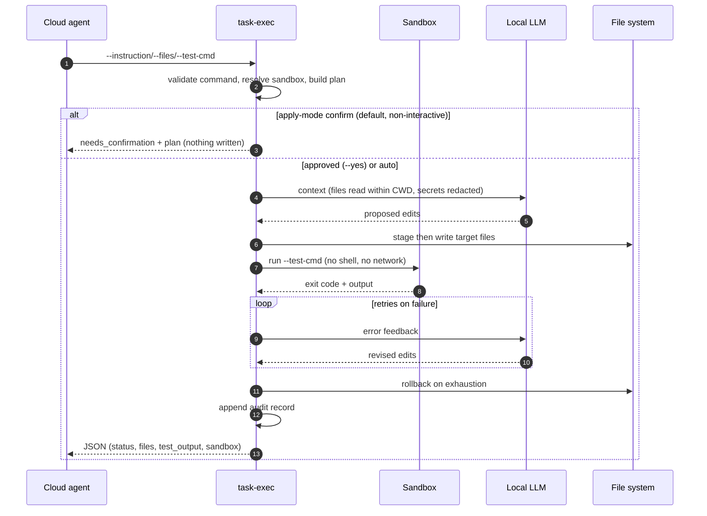
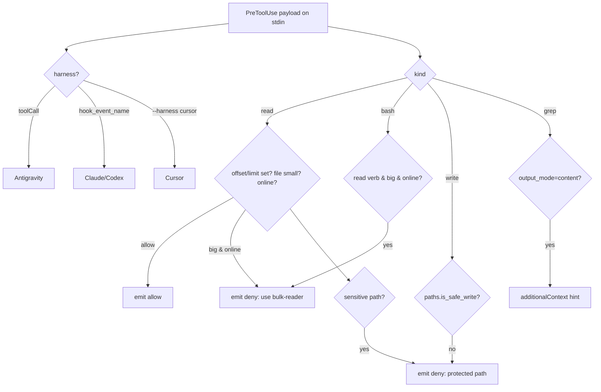

# Architecture

How the pieces fit together, the two main flows, and the remaining technical
debt. See `docs/threat-model.md` for the trust boundaries and `SECURITY.md` for
the controls.

## Modules and responsibilities

| Module | Responsibility |
| :--- | :--- |
| `scripts/lib/local-llm.sh` | Loader: sources the modules below and runs `shunt_load_config` |
| `scripts/lib/common.sh` | Library dir, temp files, path helpers, sensitive names, secret redaction |
| `scripts/lib/config.sh` | Config load, endpoint validation, enable/disable |
| `scripts/lib/validate.sh` | Command allowlist/denylist + shell-free execution |
| `scripts/lib/sandbox.sh` | bwrap/firejail/docker execution |
| `scripts/lib/audit.sh` | Audit log |
| `scripts/lib/http.sh` | Local LLM request/response handling |
| `scripts/lib/hooks.sh` | PreToolUse decision emitter |
| `scripts/lib/paths.py` | Write-safety policy (shared by the CLI and the guard); loads `sensitive-names.txt` |
| `scripts/lib/redact.py` | Secret redaction (byte-exact) |
| `scripts/lib/register.sh` | Install/update/uninstall registration (bins, skills, hooks, trust) |
| `scripts/lib/update-verify.sh` | Trusted-remote hostname check + signature verification |
| `scripts/lib/doctor.sh`, `stats.sh` | Diagnostics and audit-log summary |
| `scripts/task-exec` | Autonomous worker: plan/approve → context pack → LLM → stage/apply → sandboxed verify → rollback → audit |
| `scripts/bulk-read`, `code-write` | Single-shot delegation (read analysis / code generation) |
| `hooks/shunt_guard.py` | Cross-platform PreToolUse guard (read / bash / write / grep, three harness formats) |
| `hooks/check-*` | Thin bash wrappers around the guard (Git Bash / Unix) |
| `plugins/opencode/shunt-local.ts` | OpenCode plugin (read/bash/write interception) |
| `install.sh`, `uninstall.sh`, `scripts/shunt-update`, `install.ps1` | Lifecycle, delegating to `register.sh` |
| `scripts/bump-version` | Manifest version discipline |

## Flow: `shunt-local exec`



## Flow: guard decision



## Data flow and trust

```
repo content --untrusted--> local LLM --untrusted output--> cloud agent
                                   ^
                                   |  redacted payload
                       shunt-local tools (sandbox / approval / confinement)
```

- The cloud agent is prompt-injectable; the local-model output is labelled, not
  trusted (`untrusted_notice`).
- All outbound payloads pass `redact.py`; reads are confined to the CWD.

## Technical debt / known smells

- **Sandbox re-probes**: `shunt_sandbox_backend` runs a probe on each call; the
  `$(...)` call sites run in subshells so a simple cache does not stick. Low
  impact (a few probes per task).
- **`SHUNT_API_KEY_CMD` uses `eval`**: intentional (keyring command) and purely
  operator-controlled; treated with the same trust as `SHUNT_ALLOW_UNSAFE`.
- **Guard config loader is duplicated** with `config.sh` in Python, because the
  guard must be cross-platform and not depend on bash.
- **OpenCode sensitive-name list is mirrored** in TypeScript; a packaging eval
  fails if it drifts from `sensitive-names.txt`.
- **`task-exec` is a ~600-line monolith** (plan → context → apply → verify →
  rollback); it could be split into phases if it grows further.
